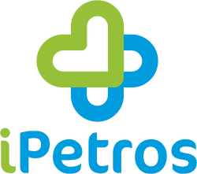
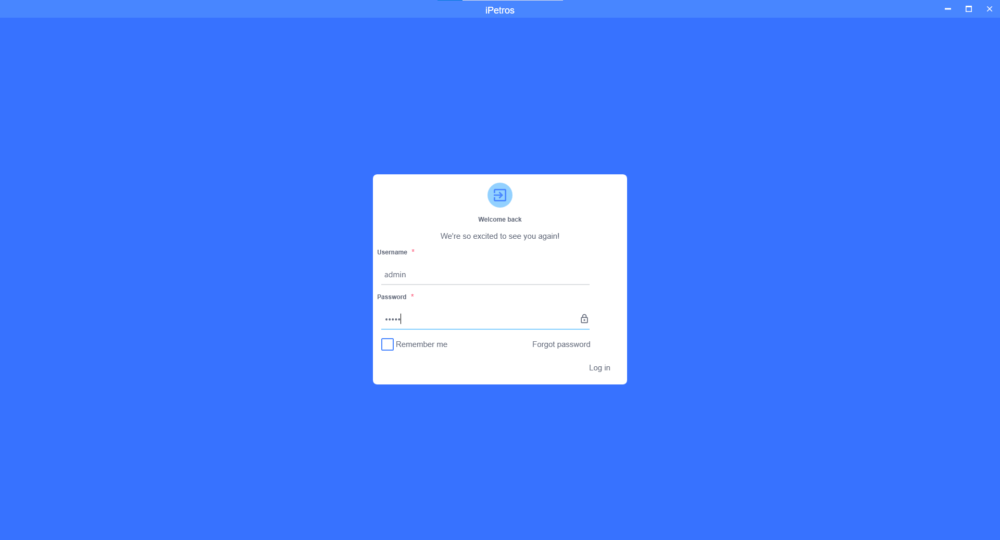
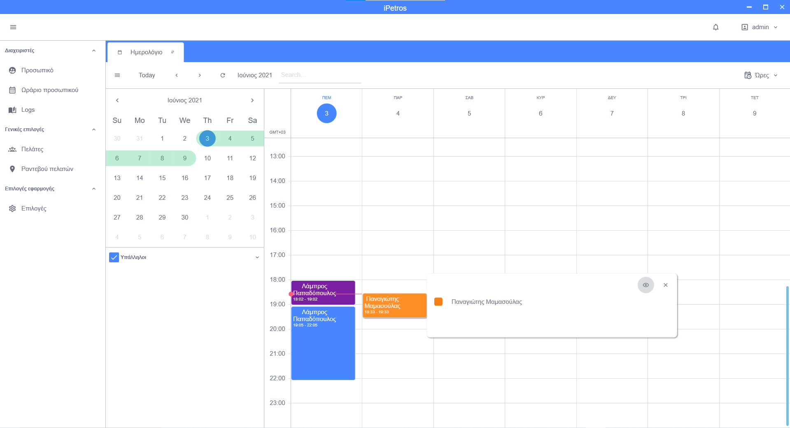
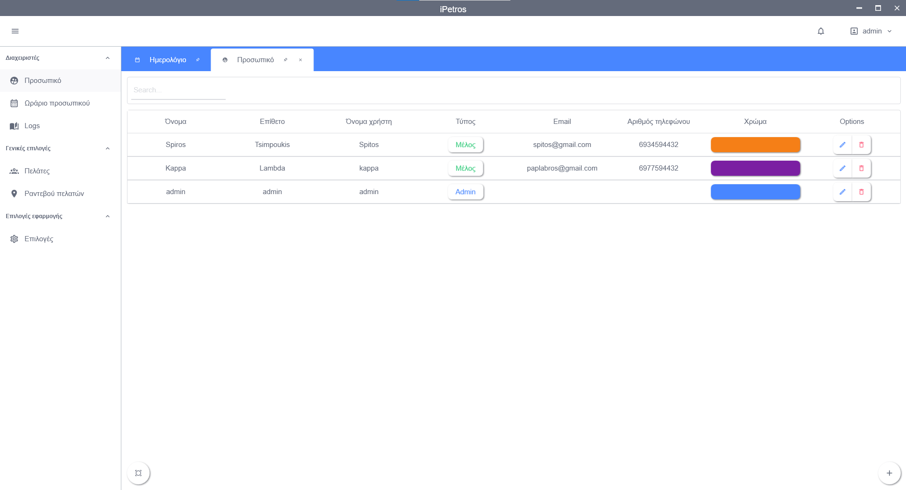
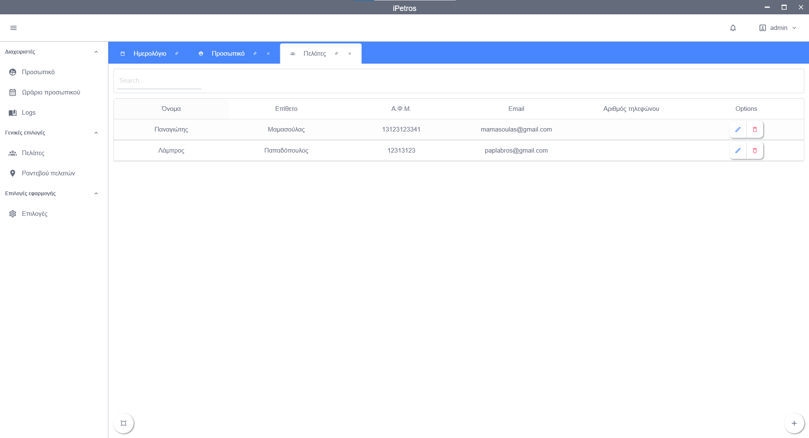
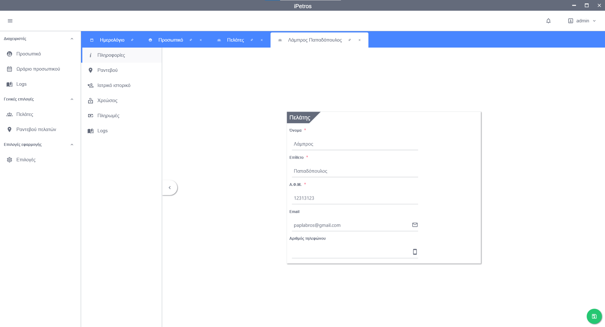
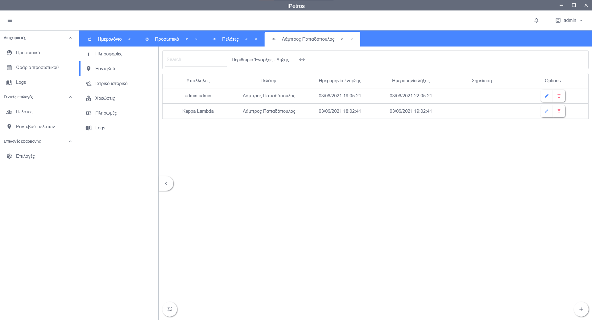
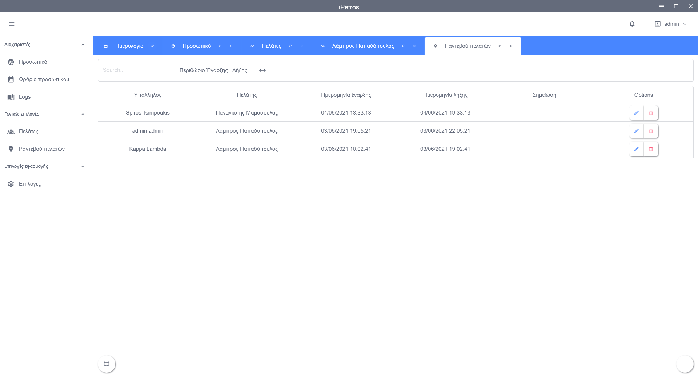

# 
In Greece almost every hospital uses its own software platform to register doctors, nurses, patients and other information. That causes various problems like lack of compatibility between different platforms and many communication problems. I-aso, willing to help these hospitals provides this platform to all of them.

## Name
This project named after a deity intertwined with the iPhone *(Άγιος Πέτρος)*.

## Contributors
* [Papadopoulos Labros](https://github.com/PapLabros): lpapad@ceid.upatras.gr
* [Mmaasoulas Panagiotis](https://github.com/PanagiotisMamasoulas)): mamasoulas@ceid.upatras.gr
* [//](https://github.com/): //@ceid.upatras.gr
* [//](https://github.com/): //@ceid.upatras.gr

## Execution
With Visual Studio 2019

## Dependencies
#### Database
1. Automatically SQLite is used, thus no server is required 

## Demo Images
##### The images below show different screens from the app
***
## Login Page

## Main Page

## Staff Members Page

## Customers Page

## Customer Page

## Customer Appointments Page

## All Customer Appointsments Page

***

## File Management and MVC Model
//